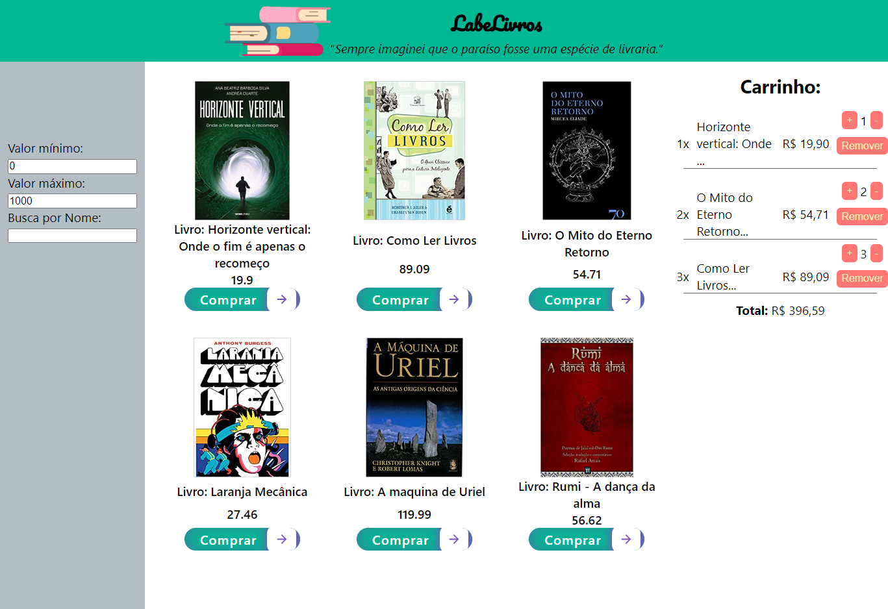

# LabeLivro

Projeto protótipo de e-commerce realizado nas aulas de React do curso de Desenvolvimento Web, para treinar lógica de carrinho de compras.

## Tecnologias usadas:

React e Styled Components.
Testado em desktop;

## Conceitos aplicados:
- Props;
- Local Storage
- Hooks useState e useEffect;
- Mock de dados;
- Map, filter e findIndex;
- Spread operator.

## Funcionalidades

- Filtra a lista de produtos por valor mínimo, valor máximo e por nome ou fragmentos do nome;
- Adiciona e remove os produtos no carrinho;
- Soma na quantidade quando o produto já existe no carrinho;
- Soma o total do carrinho em R$;
- Salva os produtos do carrinho no LocalStorage, permanecendo mesmo quando o navegador é fechado.

[Link Surge](https://exuberant-umbrella.surge.sh/)

